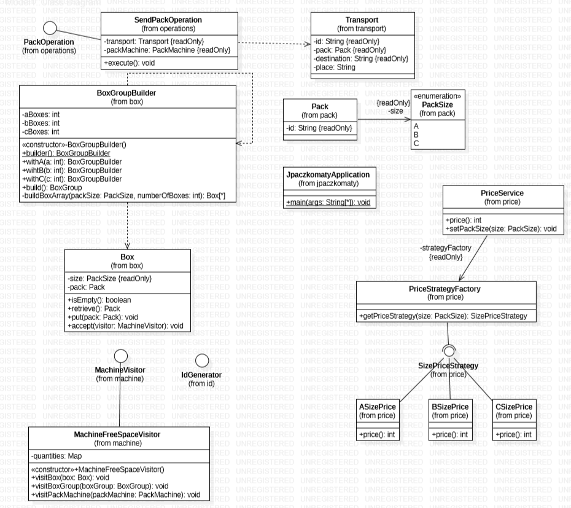

# Paczkomaty
The project is made of three modules, each for one technology: Java, Python and Angular with TypeScript. All projects are built automatically on gitlab, using CI/CD integrated features (look at: `.gitlab-ci.yml`)

Each project contains the same abstractions and models, a part of the `Paczkomat` machine.

Choose well and have fun ;-)

## UML

